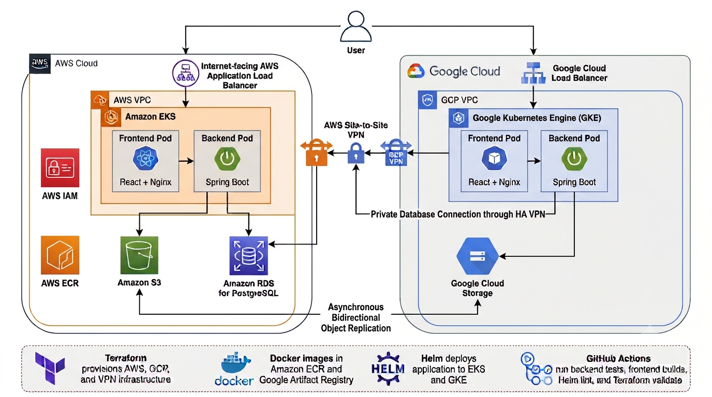

# Photo Storage

AWS와 GCP에 같은 사진 저장 서비스를 배포하고, 두 클라우드의 오브젝트 스토리지 사이에서 사진을 복제해 보기 위해 만든 개인 프로젝트입니다.

[](https://github.com/lty02-ops/Photo-storage/actions/workflows/ci.yml)

### Application


### Infrastructure


### Cloud


## 목차

- [프로젝트 소개](#프로젝트-소개)
- [주요 기능](#주요-기능)
- [아키텍처](#아키텍처)
- [기술 스택](#기술-스택)
- [설치 및 실행](#설치-및-실행)
- [사용 방법](#사용-방법)
- [구현하면서 해결한 문제](#구현하면서-해결한-문제)
- [테스트 및 CI](#테스트-및-ci)
- [향후 개선 사항](#향후-개선-사항)
- [개발자](#개발자)
- [라이선스](#라이선스)

## 프로젝트 소개

Photo Storage는 회원가입과 로그인 후 사진을 업로드하고, 다운로드하거나 공유할 수 있는 웹 애플리케이션입니다.

처음에는 Docker Compose와 로컬 파일 시스템으로 기본 기능을 구현했습니다. 이후 저장소 구현을 인터페이스로 분리해 로컬 파일 시스템, AWS S3, Google Cloud Storage 중 하나를 선택할 수 있도록 변경했습니다.

단순히 AWS와 GCP에 애플리케이션을 각각 배포하는 것에서 끝내지 않고, 두 환경이 실제로 연결되어 동작하도록 구성하는 것이 목표였습니다. AWS에서 업로드한 사진은 S3에 저장한 뒤 GCS로 복제하고, GCP에서 업로드한 사진은 GCS에 저장한 뒤 S3로 복제합니다.

EKS와 GKE에는 같은 애플리케이션을 배포했습니다. 두 클라우드의 네트워크는 HA VPN으로 연결했으며, GKE의 백엔드도 VPN을 통해 AWS RDS PostgreSQL에 접근하도록 구성했습니다.

클라우드 간 스토리지 접근에는 장기 Access Key나 서비스 계정 키 파일을 사용하지 않았습니다. AWS STS와 GCP Workload Identity Federation을 이용해 실행 중인 워크로드가 임시 권한을 발급받도록 했습니다.

현재 데이터베이스는 두 환경이 AWS RDS를 공유합니다. 따라서 애플리케이션과 오브젝트 스토리지는 두 클라우드에서 동작하지만, 데이터베이스까지 완전히 이중화된 Active-Active 구조는 아닙니다.

## 주요 기능

- 이메일 회원가입 및 로그인
- 사진 업로드, 다운로드 및 삭제
- 사진 공유 링크 생성
- 로컬, S3, GCS 저장소 지원
- S3에서 GCS로 사진 복제
- GCS에서 S3로 사진 복제
- 복제 실패 기록 및 재시도
- EKS와 GKE에 동일한 애플리케이션 배포
- Terraform을 이용한 인프라 관리
- Helm을 이용한 클라우드별 Kubernetes 설정 관리
- GitHub Actions를 이용한 자동 테스트 및 검증

## 아키텍처



### 사진 복제 과정

AWS 환경에서 사진을 업로드하면 다음 순서로 처리됩니다.

```text
사진 업로드
  → S3에 원본 저장
  → replication_jobs에 작업 생성
  → Worker가 GCS로 복제
  → 복제 상태를 COMPLETED로 변경
```

GCP 환경에서는 GCS에 원본을 저장하고 S3를 복제 대상으로 사용합니다.

복제는 업로드 요청과 분리했습니다. 대상 클라우드에 일시적인 장애가 발생해도 원본 업로드는 유지되며, 실패한 작업에는 오류 내용과 시도 횟수가 기록됩니다.

| 상태 | 의미 |
| --- | --- |
| `NOT_REQUIRED` | 로컬 저장이므로 복제가 필요하지 않음 |
| `PENDING` | 복제 대기 또는 진행 중 |
| `COMPLETED` | 대상 저장소로 복제 완료 |
| `FAILED` | 복제 실패 |

### 클라우드 간 인증

EKS에서 GCS에 접근할 때는 Kubernetes ServiceAccount 토큰을 GCP Workload Identity Federation을 통해 GCP 서비스 계정 권한으로 교환합니다.

GKE에서 S3에 접근할 때는 GCP 워크로드의 토큰을 AWS STS가 검증한 뒤 S3 접근 권한이 있는 IAM Role을 사용합니다.

이 방식으로 클라우드 자격 증명을 컨테이너 이미지나 Git 저장소에 저장하지 않았습니다.

## 기술 스택

### Backend

- Java 17
- Spring Boot
- Spring Data JPA
- PostgreSQL
- Flyway
- Redis
- AWS SDK
- Google Cloud Storage SDK

### Frontend

- React
- Vite
- Nginx

### Infrastructure

- Docker, Docker Compose
- Kubernetes
- Helm
- Terraform
- GitHub Actions

### Cloud

- AWS: EKS, ECR, S3, RDS, ALB, IAM, Site-to-Site VPN
- GCP: GKE, Artifact Registry, Cloud Storage, Cloud Load Balancing, IAM, HA VPN

## 설치 및 실행

### 필요한 프로그램

로컬 실행에는 다음 프로그램이 필요합니다.

- Git
- Docker Desktop
- Docker Compose

클라우드 인프라 생성과 배포에는 Terraform, kubectl, Helm, AWS CLI, Google Cloud CLI가 추가로 필요합니다.

### 저장소 내려받기

```bash
git clone https://github.com/lty02-ops/Photo-storage.git
cd Photo-storage
```

### 환경변수 설정

예제 파일을 복사해 로컬 환경변수 파일을 만듭니다.

```bash
cp infra/.env.example infra/.env
```

`infra/.env`에서 로컬 데이터베이스 비밀번호를 설정합니다.

```env
DB_PASSWORD=사용할_비밀번호
CLOUD_PROVIDER=local
```

실제 `.env` 파일은 Git에 포함하지 않습니다.

### 실행

```bash
cd infra
docker compose up --build
```

컨테이너가 모두 실행되면 `http://localhost:3000`으로 접속합니다.

종료할 때는 다음 명령을 사용합니다.

```bash
docker compose down
```

## 사용 방법

1. 로그인 화면에서 이메일과 비밀번호로 계정을 만듭니다.
2. 로그인 후 이미지 파일을 선택하고 `Upload` 버튼을 누릅니다.
3. 사진 목록에서 저장 위치와 복제 상태를 확인합니다.
4. 목록 오른쪽 버튼으로 사진을 다운로드하거나 공유 링크를 생성하고 삭제할 수 있습니다.

클라우드 환경에서는 화면 상단의 `Served by` 표시를 통해 현재 요청을 처리한 클라우드와 Pod를 확인할 수 있습니다.

## Kubernetes 배포 설정

클라우드별 차이는 Helm values 파일로 관리합니다.

```text
infra/helm/photo-storage/
├── values-local.yaml
├── values-aws.yaml
└── values-gcp.yaml
```

AWS 배포에는 `values-aws.yaml`, GCP 배포에는 `values-gcp.yaml`을 사용합니다. 데이터베이스 비밀번호와 같이 공개하면 안 되는 값은 저장소에 작성하지 않고 배포할 때 별도로 전달합니다.

## 데이터베이스 마이그레이션

초기에는 Hibernate의 `ddl-auto=update`를 사용했습니다. 애플리케이션 실행 시 스키마가 자동으로 변경되기 때문에 변경 내용을 추적하기 어렵다고 판단해 Flyway로 변경했습니다.

현재 초기 스키마는 다음 파일에서 관리합니다.

```text
backend/src/main/resources/db/migration/
└── V1__create_initial_schema.sql
```

Hibernate는 `ddl-auto=validate`로 설정해 엔티티와 실제 스키마가 일치하는지만 확인합니다. 이후 스키마를 변경할 때는 기존 마이그레이션을 수정하지 않고 `V2`, `V3` 형식의 SQL 파일을 추가합니다.

## 구현하면서 해결한 문제

### 사진 업로드와 복제의 분리

처음에는 사진 업로드 과정에서 다른 클라우드로 바로 복제하는 방식을 생각했습니다. 하지만 복제 대상에 장애가 생기면 원본 업로드까지 실패할 수 있었습니다.

그래서 원본을 먼저 저장한 후 `replication_jobs` 테이블에 작업을 생성하도록 변경했습니다. 별도의 Worker가 작업을 가져가서 복제하며, 실패하면 원인과 시도 횟수를 저장하고 다시 시도합니다.

### GKE에서 S3로 접근할 때 발생한 인증 실패

GCP에 배포한 백엔드에서 S3로 사진을 복제할 때 `AssumeRoleWithWebIdentity` 권한 오류가 발생했습니다.

발급된 토큰의 `aud`, `azp`, `sub` 값을 확인하고 AWS IAM Role의 신뢰 정책과 비교했습니다. 신뢰 정책의 조건을 실제 토큰 정보에 맞게 수정한 후, 별도의 AWS Access Key 없이 S3에 파일이 생성되는 것을 확인했습니다.

### GKE Ingress 백엔드 오류

GKE Ingress에 외부 IP가 할당됐지만 백엔드가 `UNHEALTHY` 상태로 남는 문제가 있었습니다. Service 포트와 BackendConfig의 연결을 확인해 수정했고, 이후 프론트엔드와 백엔드가 모두 `HEALTHY`로 변경되는 것을 확인했습니다.

### 클라우드 리소스 삭제 순서

테스트를 마친 뒤 Terraform으로 리소스를 삭제할 때 S3 버전 객체, ECR 이미지, Kubernetes에서 만든 Load Balancer와 보안 그룹 때문에 VPC 삭제가 실패했습니다.

Terraform에서 관리하는 리소스 외에도 Kubernetes Controller가 생성한 리소스가 남을 수 있다는 점을 확인했습니다. 이후 Helm 리소스와 Load Balancer를 먼저 제거하고, 저장소 내부 객체와 네트워크 의존성을 확인한 뒤 인프라를 삭제했습니다.

## 테스트 및 CI

`main` 브랜치에 코드를 push하거나 Pull Request를 만들면 GitHub Actions가 다음 작업을 수행합니다.

- Spring Boot 백엔드 테스트
- React 프론트엔드 빌드
- AWS, GCP, 로컬 Helm 설정 검사
- AWS Terraform 검사
- GCP Terraform 검사
- 멀티클라우드 네트워크 Terraform 검사

CI에서는 `terraform apply`나 Kubernetes 배포를 실행하지 않습니다. 따라서 CI 실행만으로 클라우드 리소스가 생성되지는 않습니다.

실제 클라우드 환경에서는 다음 항목을 직접 확인했습니다.

- EKS와 GKE에서 프론트엔드 및 백엔드 Pod 실행
- AWS와 GCP Load Balancer를 통한 서비스 접속
- S3와 GCS에 각각 사진 업로드
- S3에서 GCS로 사진 복제
- GCS에서 S3로 사진 복제
- GKE에서 HA VPN을 통한 AWS RDS 접속
- Workload Identity Federation을 이용한 키 없는 인증

비용이 계속 발생하지 않도록 검증 후 생성한 클라우드 리소스는 삭제했습니다.

## 향후 개선 사항

- AWS와 GCP 앞에 전역 트래픽 분산 구성
- 장애 감지와 트래픽 자동 전환
- PostgreSQL 데이터베이스 이중화
- 복제 작업에 대한 메트릭과 알림 추가
- HTTPS와 사용자 도메인 적용
- CI 이후 배포 과정 자동화
- Testcontainers를 이용한 PostgreSQL 통합 테스트

## 개발자

개인 프로젝트로 진행했습니다.

- GitHub: [lty02-ops](https://github.com/lty02-ops)

## 참고 자료

- [Kubernetes Documentation](https://kubernetes.io/docs/)
- [Terraform Documentation](https://developer.hashicorp.com/terraform/docs)
- [AWS EKS Documentation](https://docs.aws.amazon.com/eks/)
- [Google Kubernetes Engine Documentation](https://cloud.google.com/kubernetes-engine/docs)
- [Helm Documentation](https://helm.sh/docs/)
- [Flyway Documentation](https://documentation.red-gate.com/flyway)

## 라이선스

현재 별도의 라이선스를 지정하지 않았습니다.
